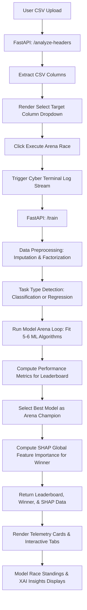

# 🤖 AutoML-Studio (v1.0 Production)
> Low-Code Predictive Analytics & Explainable AI (XAI) Telemetry Platform.

AutoML-Studio is a modern, end-to-end web application that simplifies dataset analysis, automated machine learning model training, and model interpretability. By simply dropping a CSV file and selecting a target variable, the platform automatically detects columns, infers whether the target prediction task is **Classification** or **Regression**, and runs a competitive **Model Benchmarking Arena** across multiple algorithms. 

The system displays a live-updating **Cyber Unix Terminal** logs console on the frontend, runs a comparison model evaluation, highlights the winning model as the **Arena Champion** on a sorted leaderboard, and generates global **SHAP (SHapley Additive exPlanations)** feature importance metrics for the winning model.

---

## 🚀 Key Features

* **Instant Header Extraction**: Dynamically uploads and reads the first few rows of CSV datasets to load schema definitions instantly without lag.
* **AutoML Benchmarking Arena**:
  * **Intelligent Data Preprocessing**: Automates numeric imputation (median-based) and categorical factorisation/imputation (mode-based).
  * **Heuristic Problem Classifier**: Auto-detects classification vs. regression tasks by inspecting target cardinality and data types.
  * **Multi-Model Tournament Loop**: Trains multiple machine learning algorithms simultaneously to evaluate performance standings.
    * *Classification Models*: Random Forest Classifier, Gradient Boosting Classifier, Logistic Regression, Decision Tree Classifier, Support Vector Classifier (SVC), and K-Nearest Neighbors (KNN).
    * *Regression Models*: Random Forest Regressor, Gradient Boosting Regressor, Linear Regression, Decision Tree Regressor, and Support Vector Regressor (SVR).
  * **Telemetry Performance Evaluation**: Logs key metric parameters like Accuracy & Weighted F1-Score (for classification) or MSE & R² Score (for regression).
* **Interactive Live UI Layout**:
  * **Simulated Cyber Terminal logs**: An animated Unix terminal (`automl_core_engine.sh`) that streams live model building milestones and competition logs in real time.
  * **🏁 Model Race Standings Tab**: Displays ranked scores of competing models, highlighting the gold-standard winner with a podium layout.
  * **🧠 Explainable AI (XAI) Insights Tab**: Displays relative proportional bars for global feature importance computed via SHAP.
* **Modern Sleek Dark UI**: Built with responsive layouts, visual card elements, neon accents, and interactive transitions using custom CSS.

---

## 📂 Project Architecture

* [README.md](file:///d:/Projects/AutoMLStudio/README.md) - Root Documentation
* **[automl-backend/](file:///d:/Projects/AutoMLStudio/automl-backend)** - FastAPI Microservice
  * [main.py](file:///d:/Projects/AutoMLStudio/automl-backend/main.py) - API Routing & Controllers
  * [engine.py](file:///d:/Projects/AutoMLStudio/automl-backend/engine.py) - Core ML Training & SHAP Engine
  * [requirements.txt](file:///d:/Projects/AutoMLStudio/automl-backend/requirements.txt) - Backend Python Dependencies
* **[automl-frontend/](file:///d:/Projects/AutoMLStudio/automl-frontend)** - React + Vite Client Application
  * [index.html](file:///d:/Projects/AutoMLStudio/automl-frontend/index.html) - Entry HTML
  * [package.json](file:///d:/Projects/AutoMLStudio/automl-frontend/package.json) - Frontend npm Dependencies
  * [vite.config.js](file:///d:/Projects/AutoMLStudio/automl-frontend/vite.config.js) - Bundler Configuration
  * **src/**
    * [main.jsx](file:///d:/Projects/AutoMLStudio/automl-frontend/src/main.jsx) - React Bootstrapper
    * [App.jsx](file:///d:/Projects/AutoMLStudio/automl-frontend/src/App.jsx) - Application Container & State Management
    * [App.css](file:///d:/Projects/AutoMLStudio/automl-frontend/src/App.css) - Interface Layout & Typography Styles
    * [index.css](file:///d:/Projects/AutoMLStudio/automl-frontend/src/index.css) - Global Styles & Core Typography Resets


### System Workflow Diagram


---

## 🛠️ Getting Started

Follow the steps below to set up and run AutoML-Studio on your local machine.

### Prerequisites
* Python 3.9+
* Node.js v18+ & npm

---

### 1. Backend Server Setup
1. Navigate to the `automl-backend` directory:
   ```bash
   cd automl-backend
   ```
2. Create and activate a virtual environment (optional but recommended):
   ```bash
   python -m venv venv
   # On Windows (PowerShell):
   .\venv\Scripts\Activate.ps1
   # On macOS/Linux:
   source venv/bin/activate
   ```
3. Install the required Python packages:
   ```bash
   pip install -r requirements.txt
   ```
4. Start the FastAPI development server:
   ```bash
   python main.py
   ```
   * The backend will start running locally at: `http://127.0.0.1:8000`

---

### 2. Frontend App Setup
1. Navigate to the `automl-frontend` directory:
   ```bash
   cd automl-frontend
   ```
2. Install npm packages:
   ```bash
   npm install
   ```
3. Start the Vite development server:
   ```bash
   npm run dev
   ```
   * Open the local server address displayed in your console (usually `http://localhost:5173` or similar).

---

## 🔌 API Reference (FastAPI Backend)

### 1. Root Status
* **Endpoint**: `GET /`
* **Description**: Verifies if the AutoML backend server is active and running.
* **Response**:
  ```json
  {
    "status": "AutoML Engine Active and running Live"
  }
  ```

### 2. Analyze Headers
* **Endpoint**: `POST /analyze-headers`
* **Content-Type**: `multipart/form-data`
* **Parameters**:
  * `file`: (Binary CSV file)
* **Description**: Loads the first 10 rows of the CSV to quickly return the header column list. Useful for populating frontend dropdowns without waiting for long file uploads to fully process first.
* **Response**:
  ```json
  {
    "columns": ["Age", "Salary", "Experience", "Purchased"]
  }
  ```

### 3. Model Training (Model Arena Relaunch)
* **Endpoint**: `POST /train`
* **Content-Type**: `multipart/form-data`
* **Parameters**:
  * `file`: (Binary CSV file)
  * `target_column`: (String)
* **Description**: Performs end-to-end data preprocessing, classification vs regression task detection, trains all compatible models in the ML Arena, builds a performance leaderboard, selects the winner, and computes global SHAP feature impacts for the winning model.
* **Response**:
  ```json
  {
    "task_type": "Classification",
    "best_algorithm": "Random Forest Classifier",
    "metrics": {
      "Accuracy": 0.95,
      "F1-Score": 0.9482
    },
    "leaderboard": {
      "Random Forest Classifier": 0.95,
      "Gradient Boosting Classifier": 0.9312,
      "Logistic Regression": 0.884,
      "Decision Tree Classifier": 0.865,
      "Support Vector Classifier (SVC)": 0.84,
      "K-Nearest Neighbors (KNN)": 0.812
    },
    "shap_importance": {
      "Salary": 0.452,
      "Experience": 0.3812,
      "Age": 0.125
    },
    "total_rows": 250,
    "features_count": 3
  }
  ```

---

## 🧠 Behind the Scenes: AutoML Pipeline Logic
The core engine resides in [`engine.py`](file:///d:/Projects/AutoMLStudio/automl-backend/engine.py). It runs a streamlined machine learning lifecycle:

1. **Preprocessing**:
   * Inspects all column types. 
   * Replaces categorical values with mode values (`mode()`), then performs string-to-integer mapping via `pd.factorize()`.
   * Replaces numerical missing values with median values (`median()`).
2. **Task Categorization**:
   * Evaluates the number of unique target values.
   * If target column contains string/object types or has fewer than 10 unique classes, it is treated as a **Classification** problem. Otherwise, it compiles as a **Regression** problem.
3. **Model Arena Benchmarking (Updated)**:
   * Loops through multiple estimators (classifiers or regressors), fitting each to the training set and score-ranking them based on test set metrics.
   * Identifies the best performing estimator model name as the "winner" / `best_algorithm`.
4. **Dynamic XAI Interpretability Engine (Updated)**:
   * Dynamically constructs the SHAP explainer targeting the winning model:
     - Uses `shap.TreeExplainer` for tree/ensemble models (Random Forest, Decision Trees, Gradient Boosting).
     - Uses `shap.LinearExplainer` for linear models (Linear/Logistic Regression).
     - Falls back to `shap.KernelExplainer` (with a 5-cluster k-means summary space representation to keep execution fast) for other classifiers/regressors.
   * If any exception occurs during SHAP calculation, it automatically falls back to an absolute correlation-based feature score.
   * Sorts the final output by importance descending.

---

## 🎨 User Interface & Styling
* **Framework**: React 19 bootstrapped with Vite.
* **Typography**: Styled with `Inter` / system-ui sans-serif fonts.
* **Color Palette**: Curated dark theme consisting of:
  * Primary Dark Background: `#0b0c10`
  * Secondary Dark Surfaces: `#151a22` and `#1f2833`
  * Primary Text Accent: `#c5c6c7`
  * Highlight Neon Accents: `#66fcf1` (Cyan), `#00f2fe` to `#4facfe` (Linear gradient blue), `#f1c40f` (Podium Gold)
* **Interactive Design & Layouts**:
  * **Tab Switcher**: Seamlessly toggles views between model leaderboard standings and SHAP impact metrics.
  * **Simulated Cyber Terminal console**: A retro-futuristic logging terminal featuring visual text animations showing mock pipeline compiler step outputs.
  * **Hover States & Glows**: Active card items feature neon border colors, smooth transition offsets, and soft shadow glows.
