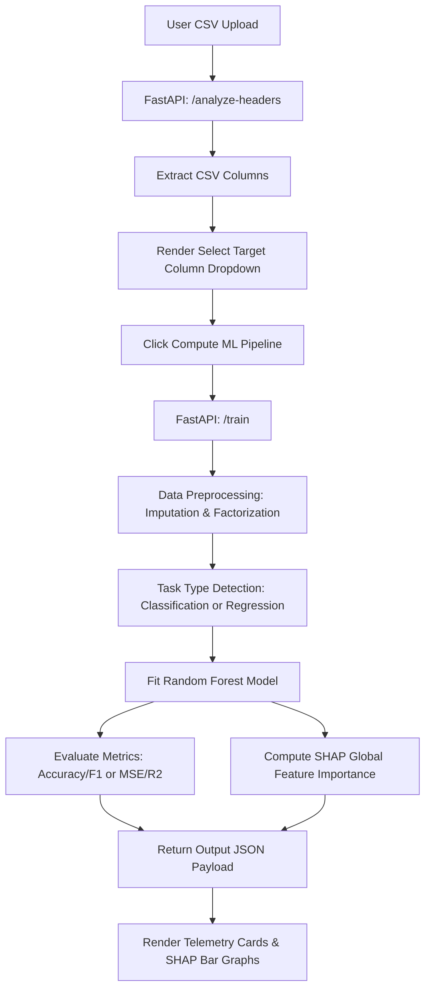

# 🤖 AutoML-Studio (v1.0 Production)
> Low-Code Predictive Analytics & Explainable AI (XAI) Telemetry Platform.

AutoML-Studio is a modern, end-to-end web application that simplifies dataset analysis, automated machine learning model training, and model interpretability. By simply dropping a CSV file, the platform automatically detects columns, infers whether the target prediction task is **Classification** or **Regression**, handles missing values and categorical encoding, trains optimized Random Forest models, and generates live **SHAP (SHapley Additive exPlanations)** feature importance metrics.

---

## 🚀 Key Features

* **Instant Header Extraction**: Dynamically uploads and reads the first few rows of CSV datasets to load schema definitions instantly without lag.
* **AutoML Engine**:
  * **Intelligent Data Preprocessing**: Automates numeric imputation (median-based) and categorical factorisation/imputation (mode-based).
  * **Heuristic Problem Classifier**: Auto-detects classification vs. regression tasks by inspecting target cardinality and data types.
  * **Optimized Random Forest Training**: Fits 100-tree classifiers or regressors with deterministic data splitting.
  * **Telemetry Performance Evaluation**: Logs key metric parameters like Accuracy & Weighted F1-Score (for classification) or MSE & R² Score (for regression).
* **Explainable AI (XAI) Dashboard**: Out-of-the-box global feature importance computed via SHAP (`shap.TreeExplainer`) and rendered with relative proportional visual bar indicators.
* **Modern Sleek Dark UI**: Built with responsive layouts, visual card elements, neon accents, and interactive transitions using custom CSS.

---

## 📂 Project Architecture

* [README.md](file:///d:/Projects/AutoMLStudio/README.md) - Root Documentation
* **[automl-backend/](file:///d:/Projects/AutoMLStudio/automl-backend)** - FastAPI Microservice
  * [main.py](file:///d:/Projects/AutoMLStudio/automl-backend/main.py) - API Routing & Controllers
  * [engine.py](file:///d:/Projects/AutoMLStudio/automl-backend/engine.py) - Core ML Training & SHAP Engine
  * [requirements.txt](file:///d:/Projects/AutoMLStudio/automl-backend/requirements.txt) - Backend Python Dependencies
* **[automl-frontend/](file:///d:/Projects/AutoMLStudio/automl-frontend)** - React + Vite Client Application
  * [index.html](file:///d:/Projects/AutoMLStudio/automl-frontend/index.html) - Entry HTML
  * [package.json](file:///d:/Projects/AutoMLStudio/automl-frontend/package.json) - Frontend npm Dependencies
  * [vite.config.js](file:///d:/Projects/AutoMLStudio/automl-frontend/vite.config.js) - Bundler Configuration
  * **src/**
    * [main.jsx](file:///d:/Projects/AutoMLStudio/automl-frontend/src/main.jsx) - React Bootstrapper
    * [App.jsx](file:///d:/Projects/AutoMLStudio/automl-frontend/src/App.jsx) - Application Container & State Management
    * [App.css](file:///d:/Projects/AutoMLStudio/automl-frontend/src/App.css) - Interface Layout & Typography Styles
    * [index.css](file:///d:/Projects/AutoMLStudio/automl-frontend/src/index.css) - Global Styles & Core Typography Resets


### System Workflow Diagram


---

## 🛠️ Getting Started

Follow the steps below to set up and run AutoML-Studio on your local machine.

### Prerequisites
* Python 3.9+
* Node.js v18+ & npm

---

### 1. Backend Server Setup
1. Navigate to the `automl-backend` directory:
   ```bash
   cd automl-backend
   ```
2. Create and activate a virtual environment (optional but recommended):
   ```bash
   python -m venv venv
   # On Windows (PowerShell):
   .\venv\Scripts\Activate.ps1
   # On macOS/Linux:
   source venv/bin/activate
   ```
3. Install the required Python packages:
   ```bash
   pip install -r requirements.txt
   ```
4. Start the FastAPI development server:
   ```bash
   python main.py
   ```
   * The backend will start running locally at: `http://127.0.0.1:8000`

---

### 2. Frontend App Setup
1. Navigate to the `automl-frontend` directory:
   ```bash
   cd automl-frontend
   ```
2. Install npm packages:
   ```bash
   npm install
   ```
3. Start the Vite development server:
   ```bash
   npm run dev
   ```
   * Open the local server address displayed in your console (usually `http://localhost:5173` or similar).

---

## 🔌 API Reference (FastAPI Backend)

### 1. Root Status
* **Endpoint**: `GET /`
* **Description**: Verifies if the AutoML backend server is active and running.
* **Response**:
  ```json
  {
    "status": "AutoML Engine Active and running Live"
  }
  ```

### 2. Analyze Headers
* **Endpoint**: `POST /analyze-headers`
* **Content-Type**: `multipart/form-data`
* **Parameters**:
  * `file`: (Binary CSV file)
* **Description**: Loads the first 10 rows of the CSV to quickly return the header column list. Useful for populating frontend dropdowns without waiting for long file uploads to fully process first.
* **Response**:
  ```json
  {
    "columns": ["Age", "Salary", "Experience", "Purchased"]
  }
  ```

### 3. Model Training
* **Endpoint**: `POST /train`
* **Content-Type**: `multipart/form-data`
* **Parameters**:
  * `file`: (Binary CSV file)
  * `target_column`: (String)
* **Description**: Performs end-to-end data preprocessing, classification vs regression task detection, trains a Random Forest model, and runs a SHAP Tree Explainer to extract global feature impacts.
* **Response**:
  ```json
  {
    "task_type": "Classification",
    "metrics": {
      "Accuracy": 0.9500,
      "F1-Score": 0.9482
    },
    "shap_importance": {
      "Salary": 0.4520,
      "Experience": 0.3812,
      "Age": 0.1250
    },
    "total_rows": 250,
    "features_count": 3
  }
  ```

---

## 🧠 Behind the Scenes: AutoML Pipeline Logic
The core engine resides in [`engine.py`](file:///d:/Projects/AutoMLStudio/automl-backend/engine.py). It runs a streamlined machine learning lifecycle:

1. **Preprocessing**:
   * Inspects all column types. 
   * Replaces categorical values with mode values (`mode()`), then performs string-to-integer mapping via `pd.factorize()`.
   * Replaces numerical missing values with median values (`median()`).
2. **Task Categorization**:
   * Evaluates the number of unique target values.
   * If target column contains string/object types or has fewer than 10 unique classes, it is treated as a **Classification** problem. Otherwise, it compiles as a **Regression** problem.
3. **Model Selection**:
   * **Classification**: Trains a `RandomForestClassifier`.
   * **Regression**: Trains a `RandomForestRegressor`.
4. **XAI Interpretability Engine**:
   * Leverages `shap.TreeExplainer` on the fitted Random Forest.
   * Extracts absolute SHAP values across test splits to summarize global feature predictive contribution.
   * Sorts the final output by impact descending.

---

## 🎨 User Interface & Styling
* **Framework**: React 19 bootstrapped with Vite.
* **Typography**: Styled with `Inter` / system-ui sans-serif fonts.
* **Color Palette**: Curated dark theme consisting of:
  * Primary Dark Background: `#0b0c10`
  * Secondary Dark Surfaces: `#151a22` and `#1f2833`
  * Primary Text Accent: `#c5c6c7`
  * Highlight Neon Accents: `#66fcf1` (Cyan), `#00f2fe` to `#4facfe` (Linear gradient blue)
* **Visual Effects**: Hover states on file inputs, soft glow shadows (`box-shadow`), linear gradients on progress bars/buttons, and smooth transitions (`transition: all 0.3s ease`).

---


